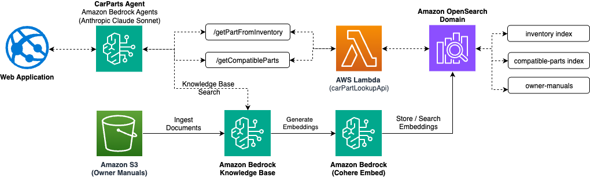
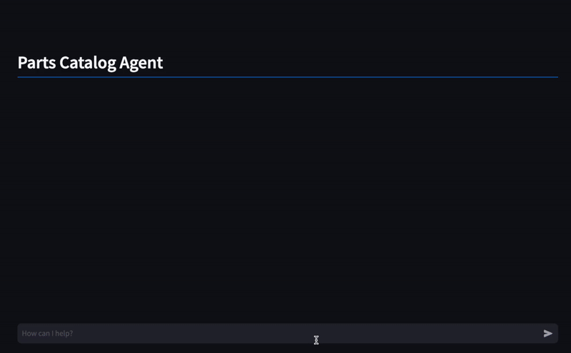

# Enhance customer support with Agents for Amazon Bedrock by integrating enterprise data APIs

Car owners and mechanics often struggle to find the right parts for specific vehicles. The challenges include:

1. Identifying the correct part for a particular make, model, and year of a vehicle.
2. Verifying compatibility of parts across different vehicle specifications.
3. Accessing detailed information about specific parts quickly and accurately.
4. Navigating complex automotive terminology and part numbers.

## Solution Overview



Our Amazon Bedrock powered Car Parts Assistant addresses these challenges by providing an intelligent, conversational interface for querying car parts information. The solution leverages Amazon Bedrock AWS to offer a seamless, user-friendly experience for finding and verifying automotive parts.

### Demo



### Key Features

1. **Natural Language Queries**: Users can ask questions about car parts in plain language, powered by Amazon Bedrock.
2. **Intelligent Part Matching**: The system can identify parts based on vehicle specifications or partial information using Amazon OpenSearch Service.
3. **Compatibility Verification**: Quickly check if a part is compatible with a specific vehicle through custom indexing in OpenSearch.
4. **Detailed Part Information**: Access comprehensive details about individual parts stored in OpenSearch indices.
5. **Knowledge-Base Integration**: Utilizes a vast database of car manuals stored in Amazon S3 for enhanced responses.

## Workflow

1. **User Interaction**:
   - A user interacts with the Car Parts Assistant through a chat interface powered by Amazon Bedrock.
   - They can ask questions like "What wiper blades fit a 2021 Honda CR-V?" or "Tell me about part number 76622-T0A-A01".

2. **Query Processing**:
   - The Amazon Bedrock Agent, powered by a large language model, interprets the user's query.
   - It extracts key information such as vehicle details or part numbers.

3. **Knowledge Base Consultation**:
   - For general inquiries, the agent consults its knowledge base in Amazon Bedrock, which includes information from various car manuals stored in Amazon S3.
   - This allows it to provide context and general information about car parts and systems.

4. **Specific Part Lookup**:
   - For specific part inquiries, the agent triggers an AWS Lambda function to query the parts database.
   - Two main actions are available:
     a. Get part information from inventory
     b. Find compatible parts for a vehicle

5. **Database Query Execution**:
   - The AWS Lambda function executes the database query against the Amazon OpenSearch Service indexes.
   - It can search for exact matches or use fuzzy matching for partial information.

6. **Result Processing**:
   - The Lambda function processes the OpenSearch results and formats them for the Bedrock agent.

7. **Response Generation**:
   - The Amazon Bedrock Agent takes the formatted results and generates a human-readable response.
   - It combines database information with its general knowledge to provide comprehensive answers.

8. **User Feedback**:
   - The response is presented to the user through the chat interface.
   - Users can ask follow-up questions or request more details, continuing the conversation with the Bedrock Agent.

## Technical Implementation

The solution is built using the following AWS services:

- **Amazon Bedrock**: Provides the AI agent capabilities for natural language understanding and generation.
- **AWS Lambda**: Handles the business logic for querying part information and interacting with other AWS services.
- **Amazon OpenSearch Service**: Stores and indexes the parts data for efficient querying and fuzzy matching.
- **Amazon S3**: Stores car manuals and images used in the knowledge base.
- **AWS CDK**: Defines and deploys the entire infrastructure as code, ensuring reproducibility and easy management of AWS resources.
- **Amazon CloudWatch**: Monitors the application and provides logging capabilities for troubleshooting and optimization.

## Benefits

1. **Improved Accuracy**: Reduces errors in part selection by providing precise compatibility information through OpenSearch queries.
2. **Time Savings**: Quickly finds relevant part information without manual searching through catalogs, leveraging the speed of OpenSearch and Lambda.
3. **Accessibility**: Makes complex automotive information accessible to both professionals and DIY enthusiasts through a natural language interface powered by Bedrock.
4. **Scalability**: Handles a wide range of queries and can be easily expanded with more data and capabilities using AWS's scalable infrastructure.
5. **Continuous Learning**: The AI model in Bedrock can be fine-tuned over time to improve its responses based on user interactions.

This Amazon Bedrock powered Car Parts Assistant streamlines the process of finding and verifying automotive parts, making it easier for users to maintain and repair vehicles with confidence, all while leveraging the power and scalability of AWS services.

## Deployment Steps

To deploy this solution, follow these steps:

1. **Prerequisites**:
   - Ensure you have AWS CLI installed and configured with appropriate permissions.
   - Install Python 3.9 or later.
   - Install Node.js 14.x or later.
   - Install AWS CDK CLI: `npm install -g aws-cdk`

2. **Clone the Repository**:
   ```
   git clone https://github.com/your-repo/ai-powered-car-parts-assistant.git
   cd ai-powered-car-parts-assistant
   ```

3. **Set Up Virtual Environment**:
   ```
   python -m venv .venv
   source .venv/bin/activate  # On Windows, use `.venv\Scripts\activate`
   ```

4. **Install Dependencies**:
   ```
   pip install -r requirements.txt
   ```

5. **Upload Custom Car Manuals** (Optional):
   If you want to include custom car manuals or data sheets for use in chat assistance:
   - Navigate to the `infra/assets/owners-manuals` directory:
     ```
     cd infra/assets/owners-manuals
     ```
   - Copy your PDF car manuals or data sheets into this directory:
     ```
     cp /path/to/your/manual.pdf .
     ```
   - Ensure all files are in PDF format for compatibility.
   - These manuals will be included in the knowledge base used by the AI assistant to provide more accurate and detailed information about specific vehicles.

6. **Return to Root Directory and Deploy the Stack**:
   After adding custom manuals, return to the root directory and deploy the stack:
   ```
   cd ../../.. && cdk deploy
   ```
   Note: You may be prompted to approve IAM role creations and other security-related changes.

   If you need to adjust any stack parameters, review and modify `infra/main.py` before running this command.

After deployment, the Amazon Bedrock powered Car Parts Assistant will be able to access and utilize any custom manuals you added to the `owners-manuals` directory, enhancing its knowledge base for providing assistance related to those specific vehicles or parts.
